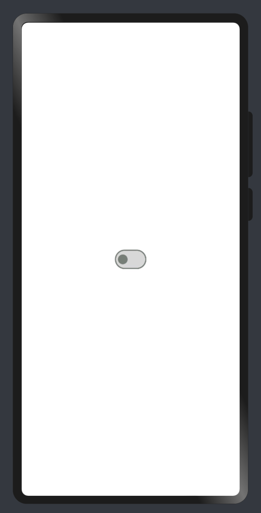
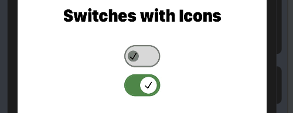

# Material_Switch

Material switch design in OpenHarmony.

## Download & Install

Install using npm

```npm i ohos-material-switch```

Details about OpenHarmony NPM environment configuration, see
at [here](https://gitee.com/openharmony-tpc/docs/blob/master/OpenHarmony_npm_usage.md)

## Usage Instructions

1. Import files and code dependencies

```ets
import { Switch, switchModel, IconImageType }  from "@ohos/material-switch"import { Switch, switchModel, IconImageType }  from "@ohos/material-switch"
```

2. Initialize switch model data

```
private model: switchModel.Model = new switchModel.Model();
```

3. Code for creating default switch

```
this.model.reset()

Switch({
    model: this.model,
    onSelect: (id, isOn) => {
            prompt.showToast({
              message: id.toString()
    })
})
```



4. Code for creating custom switch with icon

```
    this.model.reset()
    this.model.setSwitchId(1)
    this.model.setButtonColor(Color.Red)
    this.model.setWithIcon(true)
    this.model.setIsOn(true)
    this.model.setIconImageType(IconImageType.Resource)
    this.model.setIcon($r('app.media.icon'))

Switch({
    model: this.model,
    onSelect: (id, isOn) => {
            prompt.showToast({
              message: id.toString()
    })
})
```




## Compatibility


## Code Contribution


## Open source License


# Reference:

Design by : Amir Ahmed Imtiaz